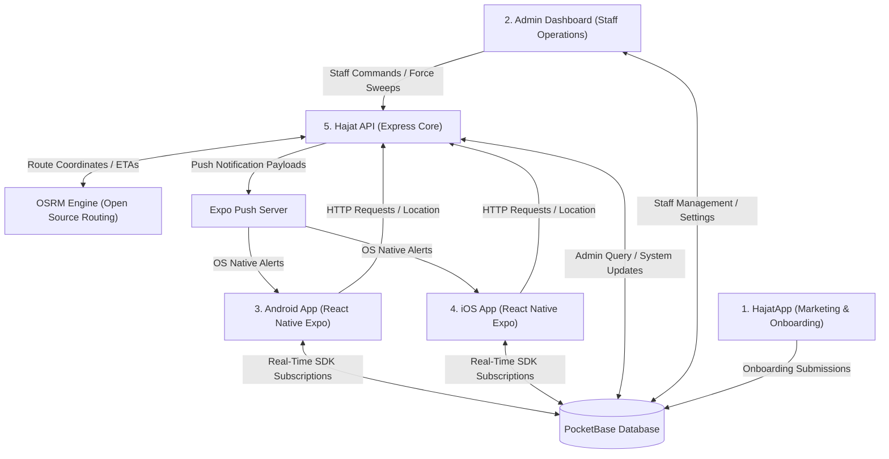
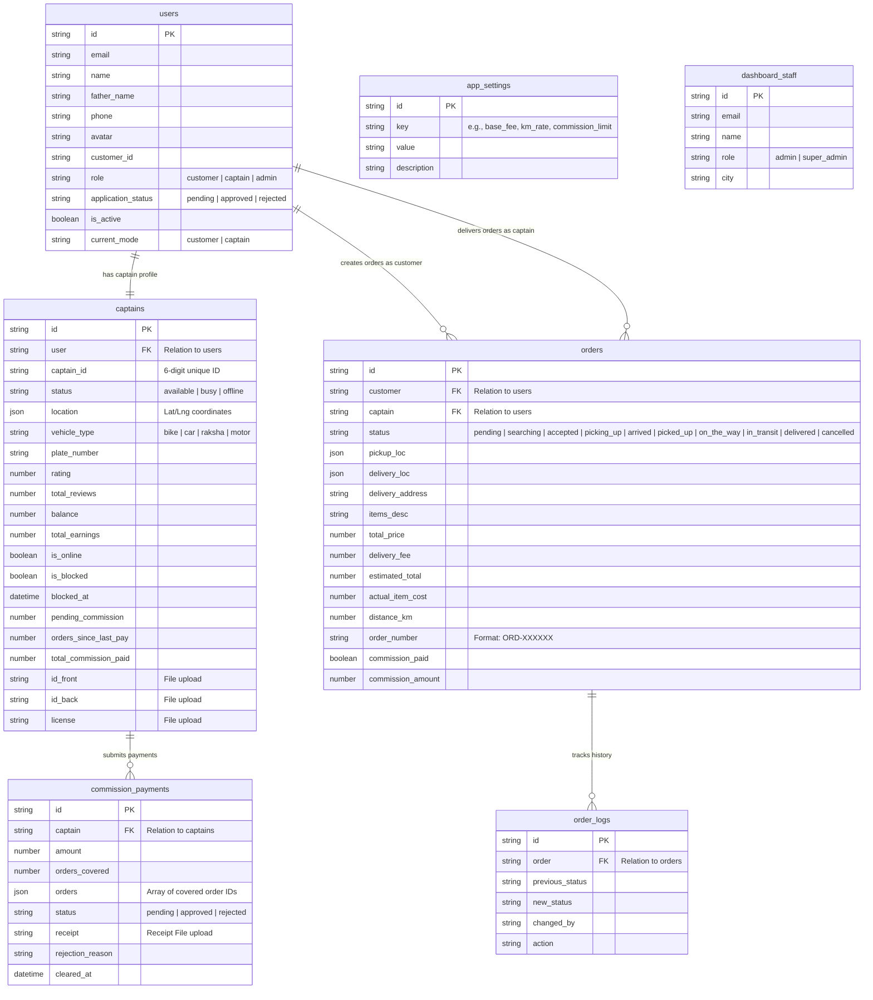
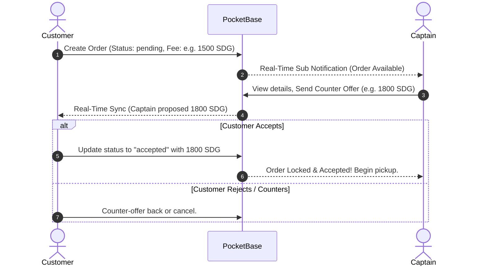
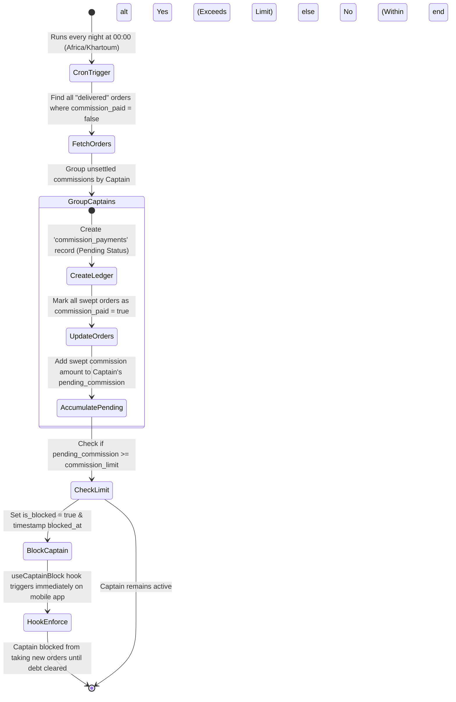

# Hajat Platform: System Architecture & Zero-to-Hero Developer Blueprint

Welcome to the **Hajat Platform**! This blueprint provides an exhaustive, absolute understanding of the Hajat ecosystem, detailing the architecture, database models, unique features, and engineering paradigms that drive the application. 

This document is designed to take any developer from **Zero to Hero**, enabling them to understand, run, and extend the project feature-by-feature and concept-by-concept.

---

## 🗺️ 1. Platform Executive Overview

**Hajat** (حاجات - meaning "Items" or "Needs" in Sudanese Arabic) is a premium, on-demand logistics, delivery, and purchasing platform engineered specifically for the Sudanese market. 

Unlike traditional delivery apps, Hajat is designed around local market dynamics:
- **Bidirectional Mode Toggling**: A single codebase powering both the Customer interface and the Captain (Driver) experience.
- **RTL Arabic Default**: Designed natively for right-to-left layout constraints, preventing alignment and visual flipping bugs.
- **Dynamic Delivery Fee Negotiation**: Recognizes local bargaining culture by allowing customers and captains to negotiate fees in real-time.
- **Micro-Surcharge & Anchor Pricing ("MagicBox")**: Calculates accurate quotes and final routes using Haversine equations and Open Source Routing Machine (OSRM).
- **Global Settings & Financial Safeguards**: Dynamically blocks Captains when their unpaid commissions exceed a centralized limit (`commission_limit`).

---

## 🏗️ 2. High-Level Ecosystem Architecture

Hajat is built as a distributed, highly real-time ecosystem consisting of 5 main components:



### Repository Summary Matrix

| Repository | Tech Stack | Role in Ecosystem | Key Constraints |
| :--- | :--- | :--- | :--- |
| **`HajatApp`** | React, TS, Vite, Tailwind CSS | Public landing page, Captain applications & Customer acquisition. | Responsive, SEO-optimized, strict Arabic RTL. |
| **`hajat-admin-dashboard`**| React, Vite, Shadcn UI, Tailwind CSS | Back-office management (Approving captains, commission payouts, live orders). | High data density, search/sort filters, RTL staff localized. |
| **`hajat-android`** | React Native, Expo, NativeWind | Android Mobile client (combined Customer + Captain app). | Material Design 3, dynamic theme toggling, custom pressable ripples. |
| **`hajat-ios`** | React Native, Expo, NativeWind | iOS Mobile client (combined Customer + Captain app). | Apple HIG standards, dynamic theme toggling, native haptics. |
| **`hajat-api`** | Express.js, PocketBase SDK, OSRM, node-cron | Custom backend server for routing, nightly sweeps, and notification jobs. | Centrally logs telemetry, handles route calculation, triggers sweeps. |

---

## 🗄️ 3. Database Schema & Data Models

Hajat utilizes **PocketBase** as its core database engine. The data model is highly optimized, linking core entities via relations to support real-time subscriptions.

### Database ER Diagram



---

## ⚡ 4. Platform Engine & Key Features

Hajat incorporates several robust, highly customized software engines that every developer must understand before modifying the code.

### A. Dynamic Mode Switching (Role Toggling)
The Hajat Android and iOS apps are not separate installations for customers and captains. Instead, **a single app dynamically morphs** based on the user's selected mode (`current_mode` in the `users` record). 

Components and views listen to `RoleContext.tsx` and dynamically swap entire UI libraries and style tokens:

*   **Customer Mode (Purple Theme)**:
    *   Accent Colors: Purple/Violet (`#6C5CE7`), Violet-Light (`#EBE9FB`).
    *   Design Language: Consumer-facing, search-centric, clean inputs for delivery addresses.
*   **Captain Mode (Android: Green Lemonade, iOS: Orange Theme)**:
    *   Accent Colors: Android uses Green Lemonade (`#A3E635`), iOS uses Apple Orange (`#FF9500`).
    *   Design Language: Utility-focused dashboard, prominent map tracking, quick-accept sheets.

### B. Foolproof Right-to-Left (RTL) Layout Engine
The Sudanese market operates primarily in Arabic. To avoid painful layout issues, Hajat implements a strict **RTL Engine Guidelines**:

1.  **Logical Properties over Physical Properties**:
    *   Never use physical properties (`ml-*`, `mr-*`, `pl-*`, `pr-*`).
    *   Always use logical properties (`ms-*` (marginStart), `me-*` (marginEnd), `ps-*` (paddingStart), `pe-*` (paddingEnd)).
2.  **Bypassing React Native Double-Flipping Bugs**:
    *   Never rely on `writingDirection: 'rtl'` or container flex overrides (`items-end`) to align Arabic text blocks. Doing so triggers engine bugs where layouts flip twice.
    *   **Always use the Hajat Text Strategy**:
        ```javascript
        style={{ width: '100%', textAlign: I18nManager.isRTL ? 'left' : 'right' }}
        ```
3.  **Automatic Flex Mirroring**:
    *   Keep parent flex containers aligned to standard directions (`flex-row`, `justify-start`).
    *   The `dir="rtl"` attribute (web) and `I18nManager.isRTL` (mobile) automatically mirror the row ordering natively without forcing hardcoded reverse structures.
4.  **Directional Icon Transforms**:
    *   Ensure back buttons, progress chevrons, and direction indicators flip when RTL is active:
        ```javascript
        style={{ transform: [{ scaleX: I18nManager.isRTL ? -1 : 1 }] }}
        ```

### C. Real-Time Delivery Fee Negotiation Protocol
Recognizing local bargaining culture, the mobile apps allow both parties to negotiate the final delivery fee prior to lock-in.



### D. MagicBox Dynamic Pricing & OSRM Routing
Hajat handles pricing in two distinct phases via `pricingService.js`:

1.  **Phase 1: Quote / Estimation (Anchor Method)**:
    *   If the exact shop coordinate isn't specified (optional pickup location), the platform defaults to the **Anchor Point Method** using averaged category radii (Pharmacy: 3.5km, Grocery: 2km, Default: 5km).
    *   The raw quote uses the formula: 
        $$\text{Estimated Fee} = \text{Base Fee} + (\text{Distance (km)} \times \text{Km Rate})$$
    *   The final estimate applies the dynamic `min_delivery_fee` and returns a soft range (e.g., `-10%` to `+20%`).
2.  **Phase 2: Final Settlement**:
    *   When the captain completes delivery, the platform calculates the true final amount using actual distance traveled and stops count.
    *   **Extra Stops Surcharge**: Multi-stop routing applies a flat surcharge per extra stop:
        $$\text{Surcharge} = (\text{Stops} - 1) \times \text{Search Surcharge Rate}$$
    *   Total Fee finalized and logged before commission sweeps trigger.

### E. Nightly Commission Sweeps & Blocking System
Rather than forcing captains to pay commissions manually on every single delivery, Hajat runs a nightly batch job and enforces an automated credit threshold.



*   **Admin Payout Settlement**:
    When a Captain pays their due commission via Sudanese payment methods (e.g., Fawry, SyberPay, bank transfer) and uploads a receipt, the Admin Dashboard verifies the transfer.
    *   Approving the payment sets the status in `commission_payments` to `approved`.
    *   This subtracts the amount from `pending_commission`, resets `orders_since_last_pay` to 0, and sets `is_blocked = false` instantly.

---

## 💻 5. Repository Structure & Configuration

Let's break down where the most critical logic files live inside each repository so a developer knows exactly where to look.

### 🔌 Hajat API (`hajat-api`)
```
hajat-api/
├── src/
│   ├── controllers/
│   │   ├── authController.js        # User signup, login & OTP
│   │   ├── orderController.js       # Core order state transitions & negotiations
│   │   └── locationController.js    # Live coordinates update tracker
│   ├── routes/
│   │   ├── adminRoutes.js
│   │   ├── routingRoutes.js         # Express routes for OSRM queries
│   │   └── locationRoutes.js
│   ├── services/
│   │   ├── pbService.js             # Initializer for PocketBase Node connection
│   │   ├── pricingService.js        # MagicBox dynamic pricing logic
│   │   ├── osmService.js            # OSRM path coordinates and route distance lookup
│   │   └── notificationService.js   # Expo push notifications & database triggers
│   └── jobs/
│       ├── commissionJob.js         # Midnight sweep cron job
│       └── chatExpiryJob.js         # Clears active chat logs 48 hours post-delivery
```

### 📱 Android & iOS Mobile Apps (`hajat-android` / `hajat-ios`)
Both mobile apps utilize **Expo Router** and share very similar structures, specialized with Material Design (Android) and Apple HIG (iOS):
```
hajat-[platform]/
├── app/
│   ├── (auth)/                      # Login, verification screens
│   ├── customer/                    # Customer-specific screens & tabs
│   │   ├── (tabs)/index.tsx         # Customer main map & MagicBox booking
│   │   └── orders/                  # Customer order tracking & negotiation
│   ├── captain/                     # Captain-specific screens & tabs
│   │   ├── (tabs)/index.tsx         # Captain dashboard & pending offers board
│   │   └── orders/                  # Captain fulfillment steps & counters
│   ├── support.tsx                  # Support tickets & audio recordings
│   └── _layout.tsx                  # Main router config, layout providers
├── components/
│   ├── MagicBox.tsx                 # Core delivery & shopping search interface
│   ├── OrderActionCard.tsx          # Real-time negotiation & status buttons
│   └── MapPickerModal.tsx           # Interactive location pinning component
├── context/
│   ├── RoleContext.tsx              # Handles customer-captain state swapping
│   └── ThemeContext.tsx             # Feeds Tailwind active style tokens
└── hooks/
    ├── useCaptainBlock.ts           # Subscribes to real-time blocks
    ├── useVoiceRecorder.ts          # Support audio recorder logic
    └── useOrderSync.ts              # Real-time state listener via PocketBase SDK
```

### 🖥️ Admin Dashboard (`hajat-admin-dashboard`)
```
hajat-admin-dashboard/
├── src/
│   ├── authProvider.ts              # Local dashboard authentication middleware
│   ├── pocketbaseConfig.ts          # Unified client config
│   ├── index.css                    # Slate-based UI token guidelines
│   ├── pages/
│   │   ├── dashboard/               # Key performance KPIs (Earnings, Active Orders)
│   │   ├── drivers/                 # Reviewing driver documents & approving captains
│   │   ├── orders/                  # Live order map & overrides
│   │   └── CommissionPage.tsx       # Clearing captain debts & approving receipts
```

---

## 🛠️ 6. Zero-to-Hero Setup Guide

This guide describes how to run the entire Hajat ecosystem locally.

### 📋 Prerequisites
Ensure you have the following installed on your machine:
- **Node.js** (v18 or higher)
- **Expo Go app** on your testing device or simulator
- **PocketBase Executable** running locally on port `8090`
- **OSRM Backend** running locally or configured to a remote route calculator (defined in `.env`)

---

### Step 1: Fire Up the Database (PocketBase)
1. Download PocketBase and run it in your working directory:
   ```bash
   ./pocketbase serve --http=127.0.0.1:8090
   ```
2. Import the complete schema provided in `pb_schema_complete.json` in the PocketBase Admin UI (`http://127.0.0.1:8090/_/`).

---

### Step 2: Run the Hajat API Core
1. Open a terminal in `hajat-api`.
2. Create your `.env` file:
   ```env
   PORT=3000
   PB_URL=http://127.0.0.1:8090
   PB_ADMIN_EMAIL=admin@hajat.com
   PB_ADMIN_PASS=HajatAdminPassword123
   OSRM_URL=http://router.project-osrm.org
   ```
3. Install dependencies and start in development mode:
   ```bash
   npm install
   npm run dev
   ```
4. Verify by navigating to `http://localhost:3000/health`.

---

### Step 3: Run the Admin Dashboard
1. Open a terminal in `hajat-admin-dashboard`.
2. Create `.env` pointing to your local database:
   ```env
   VITE_PB_URL=http://127.0.0.1:8090
   ```
3. Run the development server:
   ```bash
   npm install
   npm run dev
   ```
4. Open the dashboard at `http://localhost:5173`.

---

### Step 4: Run the Mobile Clients (Expo)
1. Open separate terminals in `hajat-android` and/or `hajat-ios`.
2. Create `.env` file mapping to your local instances:
   ```env
   EXPO_PUBLIC_PB_URL=http://[YOUR_MACHINE_LOCAL_IP]:8090
   EXPO_PUBLIC_API_URL=http://[YOUR_MACHINE_LOCAL_IP]:3000
   ```
   *(Note: Do NOT use `127.0.0.1` or `localhost` on mobile apps; physical devices or emulators require your local network IP).*
3. Run the Expo dev server:
   ```bash
   npm install
   npx expo start
   ```
4. Scan the QR code using Expo Go to boot up the app!

---

## 🌟 7. Coding Best Practices & Golden Rules

Every developer working on Hajat must rigidly adhere to these 4 architectural pillars:

### I. Keep Business Logic in Services
*   **Wrong**: Embedding OSRM distance lookups directly inside express controllers.
*   **Right**: Placing coordinates math or external requests inside `osmService.js` and dynamic quotes in `pricingService.js`, letting the controllers call them synchronously.

### II. Always Protect the Main Server Process
*   Never let database connectivity errors crash your API. Always use clean error middleware hooks and structured `try/catch` wrappers.
*   Validate all request bodies with **Zod Schemas** before processing database requests to avoid runtime format errors.

### III. The NativeWind & RTL Rule
*   Never write static properties (`ml-4`).
*   Always use logical spacing classes (`ms-4`) so Tailwind / NativeWind automatically handles the margins based on the device context direction.
*   For right-aligned texts, bypass flexbox and set:
    `style={{ width: '100%', textAlign: I18nManager.isRTL ? 'left' : 'right' }}`

### IV. Safe Real-Time Subscriptions
*   When subscribing to database updates inside React Native components, always return the unsubscribe cleanup function during the `useEffect` unmount cycle:
    ```javascript
    useEffect(() => {
      let unsubscribe;
      async function setup() {
        unsubscribe = await pb.collection('orders').subscribe(id, (e) => { ... });
      }
      setup();
      return () => unsubscribe?.();
    }, []);
    ```

---

## 🚀 Welcome Aboard!
You are now fully equipped with the system design, core logic, features, and databases of the Hajat Platform. Happy pair-programming! 🇸🇩✨
