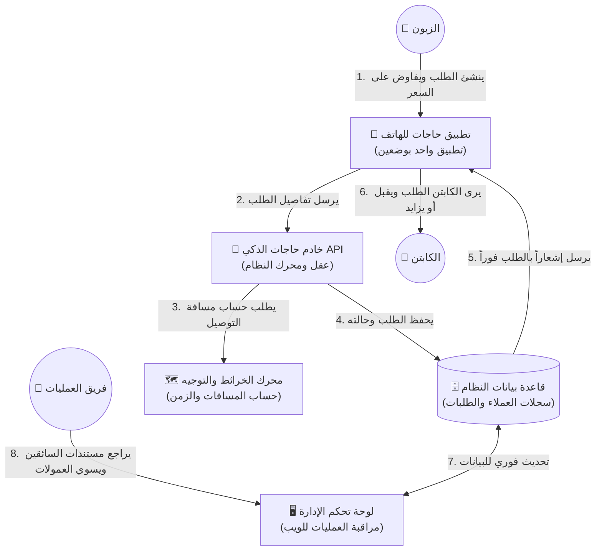

# منصة حاجات: مخطط العمليات والمنتج وإدارة الأعمال (Business, Product, & Operations Blueprint)

أهلاً بكم في **دليل أعمال ومنتج منصة "حاجات"**! في حين يركز المطورون على الأكواد والبرمجيات الخلفية، يقوم هذا المخطط بترجمة القوة التقنية لمنصة "حاجات" إلى مفاهيم تجارية وعملياتية واضحة ومبسطة.

تم إعداد هذا المستند خصيصًا **لأصحاب المصلحة غير التقنيين** (مديري المنتجات، مسؤولي العمليات التجارية، المستثمرين، والشركاء) لمساعدتكم على فهم تصميم النظام، والمنطق الأساسي للمنتج، ورحلات العملاء، وقواعد البيانات من "الصفر إلى الاحتراف".

---

## 🇸🇩 1. منصة حاجات باختصار (القيمة التجارية الفريدة)

**حاجات** هو نظام متكامل مصمم للهواتف الذكية لتوفير خدمات الخدمات اللوجستية، التوصيل، والشراء عند الطلب، وهو مخصص ومبني بالكامل خصيصاً **للسوق السوداني**.

غالبًا ما تفشل تطبيقات التوصيل التقليدية المستوردة من الدول الغربية أو دول الخليج في السودان لأنها تتجاهل الثقافة المحلية، وتحديات الشبكات، وأنماط المعاملات المالية في السودان. تميزت منصة "حاجات" بالتركيز على ثلاث ركائز أساسية:

1.  **التوافق الثقافي (ثقافة المفاصلة/التفاوض)**: في السودان، الأسعار الثابتة ليست شائعة في قطاع الخدمات الحرة، والمفاصلة هي الأصل. تدمج منصة "حاجات" ميزة التفاوض الفوري على الأسعار مباشرة داخل التطبيق.
2.  **الكفاءة التشغيلية (استراتيجية التطبيق الموحد)**: بدلاً من إجبار المستخدمين على تنزيل تطبيقات منفصلة (تطبيق للزبون وتطبيق للكابتن/السائق)، قامت "حاجات" بدمج الواجهتين في تطبيق ذكي واحد. يمكن للمستخدم التبديل بين وضع الزبون ووضع الكابتن بلمسة واحدة.
3.  **الحماية المالية والأمان (حدود العمولات)**: نظرًا لأن الدفع الإلكتروني آخذ في النمو ولكن الكاش لا يزال هو السائد، تتبع المنصة عمولتها المستحقة من الكباتن في الوقت الفعلي، وتقوم بحظر الكابتن تلقائياً عند تجاوزه حد المديونية المسموح به لضمان تحصيل مستحقات الشركة.

---

## 🗺️ 2. الصورة الكاملة (كيف تتكامل مكونات النظام؟)

إليكم شرح مبسط لكيفية تواصل الأجزاء المختلفة لمنصة "حاجات" لتلبية طلب توصيل واحد:

---

## 🛵 3. الميزات الجوهرية والمنطق التجاري للمنتج (ببساطة)

### أ. مبدل الوضع الثنائي (تطبيق واحد، دورين مختلفين)
*   **المشكلة**: إن بناء وتحديث وتسويق تطبيقين منفصلين (واحد للعملاء وآخر للسائقين) أمر مكلف للغاية ويضاعف تكاليف جذب المستخدمين وتنزيل التطبيقات.
*   **الحل التشغيلي في "حاجات"**: قمنا ببناء تطبيق موحد.
    *   بشكل افتراضي، يفتح التطبيق على **وضع الزبون** (يتميز بهوية بصرية وواجهات باللون **البنفسجي** الجذاب والمريح للمستخدم).
    *   إذا كان المستخدم كابتنًا معتمدًا، يمكنه بلمسة زر واحدة في ملفه الشخصي تحويل التطبيق بالكامل إلى **وضع الكابتن** (يتميز بواجهات عالية الوضوح باللون **الأخضر الليموني / البرتقالي**).
*   **الفائدة التجارية**: خفض تكاليف التطوير البرمجي للنصف، تسويق علامة تجارية واحدة وتطبيق واحد، ومرونة فائقة للمستخدمين (حيث يمكن للزبون أن يتحول لكابتن لتوصيل الطلبات في أوقات فراغه بسهولة).

---

### ب. بروتوكول التفاوض الفوري على الأسعار (المفاصلة)
*   **المشكلة**: محركات التسعير الثابتة والصارمة تؤدي إلى نسب إلغاء مرتفعة للطلبات. فإذا كانت الطريق وعرة، أو هناك زحام شديد، أو أزمة وقود، سيرفض السائقون السعر الثابت للتطبيق. وإذا كان السعر مرتفعاً، سينفر العميل.
*   **الحل التشغيلي في "حاجات"**: يعتمد النظام تقنية **التفاوض الديناميكي الفوري**:
    1.  يقوم التطبيق بحساب واقتراح سعر عادل مبدئي بناءً على مسافة التوصيل الفعلية.
    2.  يقوم الزبون بتقديم الطلب مع إمكانية تعديل السعر المقترح صعوداً أو هبوطاً كعرض أولي.
    3.  يظهر الطلب للكباتن القريبين. وبدلاً من مجرد القبول أو الرفض، يمكن للكابتن إرسال **عرض سعر مضاد** (مثال: "سأقوم بتوصيل هذا الطلب بـ 1800 جنيه سوداني بدلاً من 1500").
    4.  يتلقى الزبون إشعاراً فورياً ويملك الخيار التام بـ **القبول** أو **الرفض**.
*   **الفائدة التجارية**: زيادة هائلة في نسب نجاح وقبول الطلبات (Match Rate)، وإرضاء الطرفين، ومواكبة ذكية ومستمرة لتغيرات السوق وأسعار الوقود اليومية في السودان.

---

### ج. تسعير "صندوق السحر" (MagicBox) ورسوم المحطات الإضافية
*   **المشكلة**: في كثير من الأحيان، يرغب العملاء في طلب شراء أغراض دون معرفة الموقع الدقيق للصيدلية أو المتجر، أو يرغبون في توجيه الكابتن للتوقف في عدة محطات لشراء وتجميع الحاجيات (مثل شراء دواء من صيدلية أ، ثم خبز من مخبز ب، ثم التوصيل للمنزل).
*   **الحل التشغيلي في "حاجات"**:
    *   **مواقع الالتقاط الاختيارية**: إذا لم يحدد الزبون موقعاً دقيقاً للمتجر، يقوم النظام بتطبيق **طريقة الإرساء الافتراضي** بناءً على متوسط المسافات للخدمة (مثل تخصيص متوسط 3.5 كم للصيدليات و2 كم للبقالات) لإعطاء تقدير مالي صادق قبل الانطلاق.
    *   **رسوم المحطات الإضافية**: إذا اضطر الكابتن للتنقل والتوقف في أكثر من مكان لشراء الطلبات، يضيف النظام تلقائياً **رسوم محطات إضافية** إلى الفاتورة النهائية تعويضاً لجهد الكابتن ووقته واستهلاك الوقود.
*   **الفائدة التجارية**: مرونة تشغيلية لا متناهية للزبائن الذين يودون قضاء مشاوير يومية معقدة، مع ضمان التعويض العادل لجهد الكباتن.

---

### د. حماية عمولة المنصة ونظام الحظر التلقائي للكباتن
*   **المشكلة**: يتحصل الكباتن على الأموال نقداً (كاش) مباشرة من العملاء. وإذا لم يكن هناك نظام صارم وتلقائي لتحصيل حصة المنصة (العمولة)، فقد تتراكم على الكباتن ديون ضخمة لصالح الشركة دون وسيلة فعالة للتحصيل.
*   **الحل التشغيلي في "حاجات"**:
    *   مع كل طلب يتم تسليمه بنجاح، يتم احتساب عمولة المنصة (مثال: 10%) وتضاف إلى حساب الكابتن تحت بند **العمولة المعلقة (Pending Commission)**.
    *   إذا تجاوزت هذه العمولة المعلقة حداً مالياً معيناً (مثال: 10,000 جنيه سوداني، يتم تحديده مركزياً من الإدارة)، يقوم النظام **بإيقاف وحظر الكابتن تلقائياً** من استقبال أي طلبات جديدة.
    *   تتحول شاشة التطبيق لدى الكابتن فوراً إلى شاشة تنبيه حمراء تشرح له سبب الحظر، وتوجهه لكيفية سداد المديونية للمنصة لاستعادة الحساب.
*   **الفائدة التجارية**: حماية التدفقات النقدية للشركة، تقليل الديون الهالكة والديون غير المحصلة، وإدارة العملية المالية بشكل آلي وذاتي بالكامل دون الحاجة لمراقبة يدوية مستمرة من موظفي التشغيل.

---

### هـ. تسوية المدفوعات والعمولات (دورة العمليات)
*   **آلية عمل السداد والتشغيل**:
    1.  يقوم الكابتن المحظور بإرسال مبلغ العمولة المستحق للمنصة عبر إحدى وسائل الدفع المحلّية المتاحة (مثل بنكك، فوري، سايبرباي، أو التحويل البنكي).
    2.  يرفع الكابتن صورة إيصال الدفع أو التحويل مباشرة عبر التطبيق.
    3.  في **لوحة تحكم الإدارة (Admin Dashboard)**، يظهر التحويل فوراً لموظف التشغيل، حيث يراجع رقم المعاملة وصورة الإيصال، وبضغطة زر واحدة يضغط **موافقة (Approve)**.
    4.  تتصفر مديونية الكابتن فوراً، ويقوم النظام **بإلغاء الحظر تلقائياً في نفس اللحظة** ليعود للعمل وكسب الأرباح.

---

## 🗄️ 4. قواعد البيانات بلغة مبسطة (ما الذي نقوم بتخزينه؟)

لضمان سير العمليات بكفاءة، يقوم النظام بحفظ وتأمين البيانات الحساسة في ستة أوعية رئيسية. إليكم ترجمة مبسطة ومفهومة لمعنى هذه البيانات وفائدتها للأعمال:

| وعاء البيانات | الفائدة التجارية والتشغيلية | أهم البيانات المحفوظة |
| :--- | :--- | :--- |
| **👤 المستخدمون (Users)** | قاعدة بيانات المشتركين الأساسية في الخدمة. | الاسم، اسم الأب، رقم الهاتف، الدور (زبون/كابتن)، الوضع الحالي النشط، وحالة التفعيل. |
| **🛵 ملفات الكباتن (Captains)** | البيانات المهنية الخاصة بالسائقين ومركباتهم. | نوع المركبة (ركشة/موتر/سيارة)، لوحة الترخيص، صور الهوية ورخصة القيادة، التقييم، الأرباح الكلية، العمولة المعلقة، وحالة الحظر. |
| **📦 الطلبات (Orders)** | سجل تفصيلي لكافة عمليات الشراء والتوصيل. | موقع الالتقاط، موقع التوصيل، تفاصيل الأغراض المطلوبة، السعر التقديري، السعر النهائي المتفق عليه، وحالة الطلب. |
| **💸 مدفوعات العمولات** | السجل المالي لتحصيل عمولات المنصة. | القيمة المدفوعة، التاريخ، صورة إيصال الدفع المرفوع، وحالة الطلب (مقبول / مرفوض / معلق المراجعة). |
| **⚙️ إعدادات التطبيق (Settings)** | مفاتيح التحكم والتحجيم التجاري لكامل المنصة. | سعر الكيلومتر، السعر الأساسي للطلب، وحد المديونية الأقصى المسموح به قبل حظر الكابتن. |
| **🪵 سجلات الحركة (Order Logs)** | سجل المتابعة والتدقيق لحل النزاعات. | تتبع دقيق بالثواني لكافة الحركات والتغيرات التي تطرأ على الطلبات (متى انطلق الكابتن، متى وصل، ومن قام بالتعديل). |

---

## 📊 5. العمليات والمؤشرات التشغيلية الأساسية (KPIs)

لمدراء التشغيل وصناع القرار، هذه هي أهم المؤشرات التي يجب مراقبتها باستمرار عبر **لوحة تحكم الإدارة** لتقييم صحة واستقرار العمل التجاري:

1.  **نسبة قبول وتلبية الطلبات (Match Rate %)**:
    *   *المفهوم*: النسبة المئوية للطلبات التي تم قبولها وتوصيلها فعلياً من إجمالي الطلبات المنشأة.
    *   *أهميتها*: انخفاض هذه النسبة يعني أن أسعار التوصيل المقترحة من المنصة منخفضة جداً ولا تغري السائقين، أو أن هناك نقصاً حاداً في أعداد الكباتن في تلك المنطقة.
2.  **متوسط زمن المفاصلة والتفاوض**:
    *   *المفهوم*: الوقت المستغرق منذ إطلاق الطلب وحتى اتفاق الزبون والكابتن على السعر النهائي.
    *   *أهميتها*: يجب الحفاظ على هذا المؤشر في حدود أقل من دقيقتين لضمان تجربة حجز سلسة وسريعة للزبائن.
3.  **إجمالي ديون العمولة المعلقة المستحقة**:
    *   *المفهوم*: إجمالي الأموال التي يدين بها الكباتن النشطون كعمولات مستحقة للمنصة.
    *   *أهميتها*: تساعد الفريق المالي على التنبؤ بالأرباح والتدفقات النقدية الواردة والتحكم في المخاطر المالية.
4.  **طلبات الانضمام المعلقة للكباتن**:
    *   *المفهوم*: عدد الكباتن الذين سجلوا وينتظرون مراجعة أوراقهم ورخصهم لتفعيل حساباتهم.
    *   *أهميتها*: يجب على فريق العمليات تفعيل الحسابات بسرعة وسلاسة لضمان توفير إمداد كافٍ ومستمر من الكباتن لتلبية الطلب المتزايد.

---

## 🌟 6. التوصيات الذهبية لنجاح الأعمال التجارية في منصة حاجات

لضمان الهيمنة التامة لمنصة "حاجات" على سوق الخدمات اللوجستية والتوصيل في السودان، يجب على القادة التشغيليين الالتزام بالقواعد التالية:

*   ✔️ **احمِ ميزة التفاوض**: لا تلغِ ميزة المفاصلة والأسعار التفاعلية أبداً؛ فهي الميزة التنافسية الأقوى للحفاظ على الكباتن والزبائن مقارنة بالشركات الخليجية ذات التسعير الجامد.
*   ✔️ **ثق بالبيانات لا بالعواطف**: استخدم سجلات الحركة والمسارات الجغرافية الموثقة لحل الشكاوى والنزاعات بين السائقين والزبائن بكل عدالة وشفافية.
*   ✔️ **التحقيق الصارم في الهويات**: يجب على فريق العمليات تدقيق صور رخص القيادة وشهادات إثبات الشخصية للكباتن بدقة بالغة. سلامة وأمان العميل هي أساس استمرار العلامة التجارية.
*   ✔️ **الموازنة الذكية للحدود المالية**: راجع حد الحظر التلقائي للعمولات باستمرار. فإذا كان منخفضاً جداً سيضايق الكباتن بكثرة التوقف والحظر، وإذا كان مرتفعاً جداً سيعرض أرباح المنصة لمخاطر الديون الصعبة.

---

🇸🇩 **حاجات مبنية بأيدي وعقول تفهم وتلبي حاجات المجتمع السوداني.** 🚀
